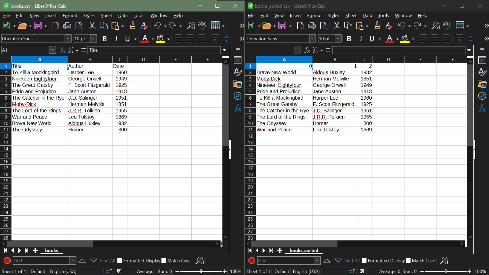

# Simple Book Sorting Application

This is a simple Python script for sorting a list of books based on their title, author, or publication date. It allows you to choose whether you want to sort the books in ascending or descending order.

## How to Use

1. Make sure you have a CSV file with book data. You can specify the file path in the `file_path` variable.

2. The CSV file should have the following columns:
   - Column 0: Book Title
   - Column 1: Author
   - Column 2: Publication Date

3. Run the script in a Python environment.

4. You will be prompted to make the following choices:

   - Enter `1` to sort books by title.
   - Enter `2` to sort books by author.
   - Enter `3` to sort books by date.

   After choosing the sorting type, you will be prompted for the sorting order:

   - Enter `1` to sort books in ascending order (A-Z, 1-9).
   - Enter `2` to sort books in descending order (Z-A, 9-1).

5. The sorted data will be written to a new CSV file named "books_sorted.csv" in the same directory as the script.

## Dependencies

This script uses the following Python libraries:

- pandas: For reading and writing CSV files and data manipulation.
- numpy: For array manipulation.

## Example Usage

Suppose you have a CSV file named "books.csv" with book data in the specified format. Running this script will allow you to sort the books based on your criteria and save the sorted data to "books_sorted.csv."

Please ensure you have the required libraries installed in your Python environment.

**Note:** This is a simple example of how to sort data in a CSV file. For more complex use cases or larger datasets, you may want to explore more efficient and scalable sorting methods.

Feel free to modify and improve this code according to your specific needs.

## Example
In this particular scenario, the dataset is organized in a structured manner within a file named "Books.csv," and it is sorted in a specific way, which is by the publication date of the books. The user has made a selection, specifying "1,1" which corresponds to sorting by "Author" in an ascending (ascending alphabetical order) fashion. On one side of the user interface, we have the original "Books.csv" file, which contains the unsorted data or the initial dataset. On the other side, we have a new file labeled "books_sorted.csv," which is the result of the sorting operation the user initiated.

